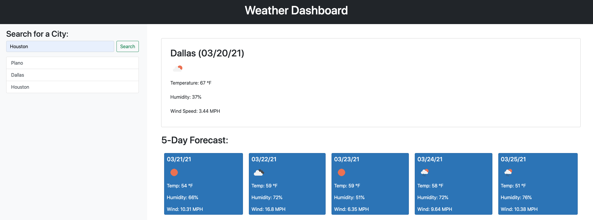

# weather-dashboard

## Description
This is a weather dashboard that displays the current weather and 5-day forecast for the city inputted by the user.

## Details

* Used two APIs from https://openweathermap.org/ to display the current and future weather. The displayed weather data consists of:
    * Weather conditions icon
    * Temperature
    * Humidity
    * Wind Speed

* When the user inputs a city, it is saved in local storage and displayed under the search form to easily toggle back to that particular city's weather data.
* When the user refreshes the page, their search history is displayed.
* Used Bootstrap to style the page layout and search history list group.

## Live Application
You can view the live application [here](https://mrpancakes.github.io/weather-dashboard/), along with the GitHub repo [here](https://github.com/mrpancakes/weather-dashboard).

